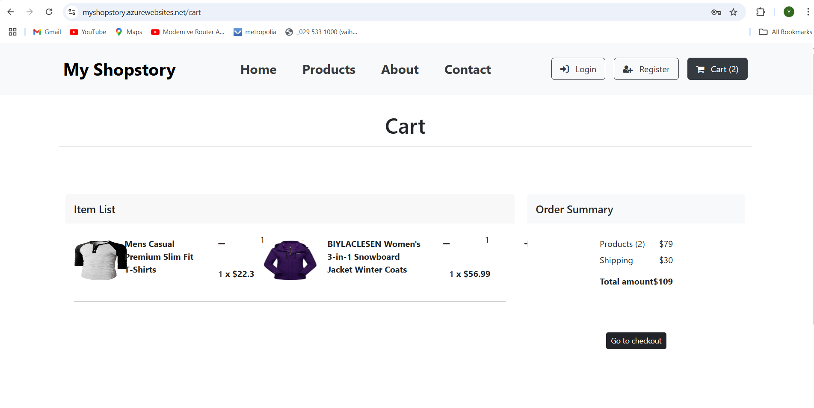

Install dependencies

```bash
  npm install
```

Start the server

```bash
  npm start
```
# My Shopstory

## Screenshots





## Published Application
- Front-End: [https://myshopstory.azurewebsites.net/](https://myshopstory.azurewebsites.net/)

## Back-End Application/API
- Back-End: [https://github.com/yasinSahyar/My-Shopstory/tree/checkout/backend](https://github.com/yasinSahyar/My-Shopstory/tree/checkout/backend)


## Database Description
- **Database Name**: `shopstory_db`
- **Table**: `users`
  - `id` (INT, AUTO_INCREMENT, PRIMARY KEY)
  - `full_name` (VARCHAR(255), NOT NULL)
  - `email` (VARCHAR(255), UNIQUE, NOT NULL)
  - `password` (VARCHAR(255), NOT NULL)
  - `created_at` (TIMESTAMP, DEFAULT CURRENT_TIMESTAMP)

- **Table**: `messages` 
  `id` int(11) NOT NULL AUTO_INCREMENT,
  `name` varchar(255) NOT NULL,
  `email` varchar(255) NOT NULL,
  `message` text NOT NULL,
  `created_at` timestamp NULL DEFAULT current_timestamp(),
  


## Functionalities Implemented
- User registration and login with MySQL database integration.
- Product listing with filtering (All, Men's Clothing, Women's Clothing).
- Add to cart and view cart functionality.
- Checkout process with billing address and payment details.
- About Us and Contact Us pages.
- Responsive navigation bar and footer.

## Known Bugs/Problems
- The checkout button is disabled (needs payment gateway integration).
- No logout functionality implemented yet.

## References and Tutorials
- React Tutorial: [React Official Documentation](https://reactjs.org/)
- Redux Tutorial: [Redux Documentation](https://redux.js.org/)
- MySQL with Node.js: [MySQL2 Documentation](https://www.npmjs.com/package/mysql2)
- Graphics Libraries: React-Bootstrap, Font Awesome


